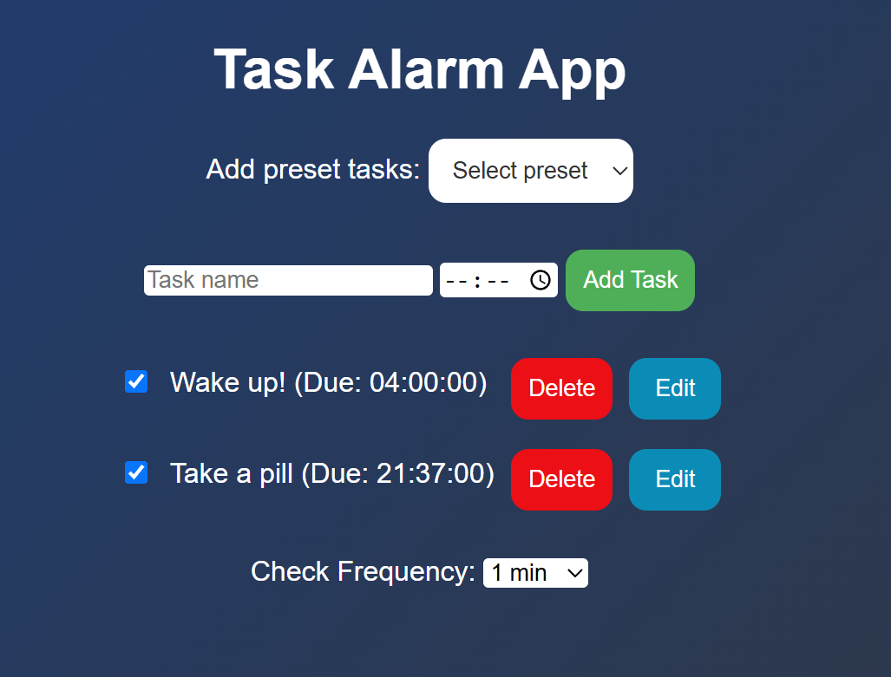

# DidITakeIT
*(localStorage version on **main** branch | Spring Boot version on **master** branch)*

#### Yes, that's what I wanted – another alarm! 🤣
#### This time I won't forget!

DidITakeIT is a simple daily task reminder application designed to help you remember your important tasks (like taking your medication!). Just add your daily tasks, and if they're not checked off by their due time, an alarm will play once every minute until you mark them as finished.

## Features

- **Daily Task Reminders:**  
  Add tasks you need to complete each day and never miss them again!
- **Alarm Notification:**  
  If a task remains unchecked past its due time, an alarm sound plays once per minute until the task is completed.
- **Two Versions:**
    - **LocalStorage Version:** Runs entirely in your browser (main branch).
    - **Spring Boot Version:** A backend-powered version with ~~persistent storage~~ in-memory H2 database (master branch).

## Screenshots

## How It Works

1. **Add Your Task:**
    - Enter the task name and set the due time (tasks are always for today).
    - Alternatively, use the "Add preset tasks" dropdown to select from pre-defined task templates.
        - **Note:** You can edit the task name and due time of preset tasks after adding them.

2. **Complete Your Task:**
    - Check off the task once it's done.
    - If left unchecked, the alarm sound will continue playing at the specified frequency.

3. **Alarm Behavior:**
    - The sound plays repeatedly for any overdue task until you mark it as complete.
    - You can adjust the frequency of the alarm sound using the "Check Frequency" dropdown (e.g., 1 min, 5 min, etc.).
- 